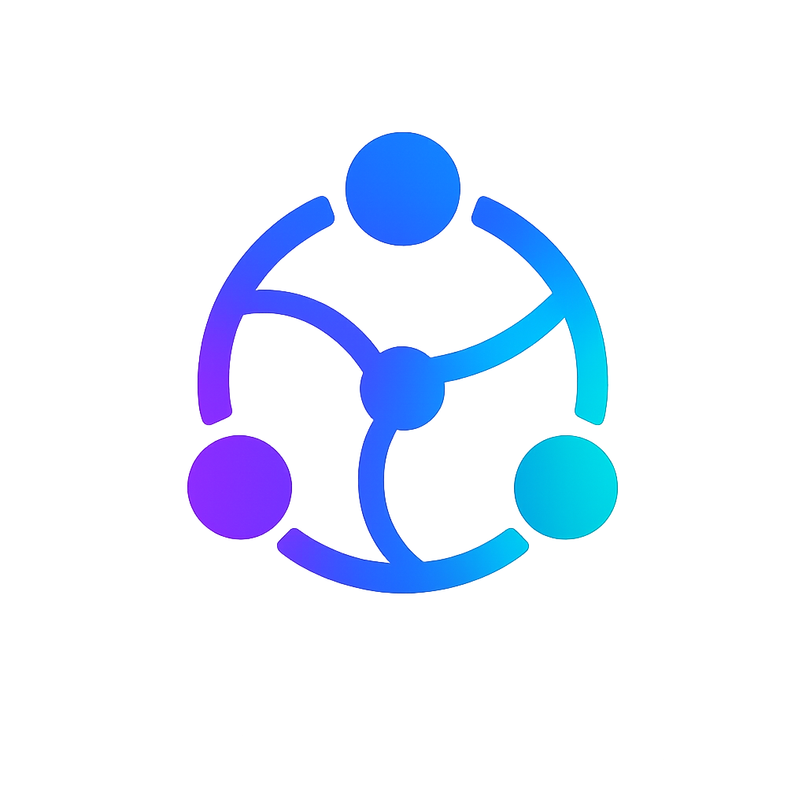

<p align="center">
  
</p>

# Open Social Network Page

Open Social Network Page is the official sovereign page template for Open Social Network.

It is a simple social page you can host anywhere static files work.

It lets a person publish a page, posts, and verification data as ordinary static files:

- `profile.json`
- `feed.json`
- `/.well-known/open-social-network.json`
- a human-readable profile page

The page can be hosted on GitHub Pages, Cloudflare Pages, Netlify, a VPS, a personal server, or any static hosting provider.

## In One Minute

Open Social Network Page is a starter kit for owning your social presence.

It creates:

1. a visible profile page
2. signed posts
3. a public action inbox path for likes, dislikes, and comments
4. an encrypted message inbox path
5. public files that any aggregator can read
6. technical files for verification

An Open Social Network aggregator can read these files and verify that the posts came from this identity.

## Your Social Identity as a Page on the Internet

The web already understands independent ownership.

You can own a domain. You can publish a website. You can send email across providers. Increasingly, AI systems can connect through shared protocols like MCP.

But social media is still mostly platform-owned. Your handle, audience, posts, and reputation are usually locked inside someone else's product.

Open Social Network Page changes the starting point:

Your profile is yours.

Your feed is yours.

Your identity is yours.

Aggregators can read and display your page, but they do not own it.

## Why This Matters

Open Social Network is built around a simple idea: a social profile should be a page on the internet, not a row inside a platform database.

This template makes that idea real. It gives a user a sovereign page that aggregators can read, verify, and display without owning the user's identity or audience.

## What You Get

- a human-readable profile page
- a machine-readable `profile.json`
- a signed `feed.json`
- a `.well-known` discovery file
- public action files for portable likes, dislikes, and comments
- an encrypted message inbox file
- local key generation
- validation that verifies every post signature
- a deployment model that works with ordinary static hosting

## Benefits

For individuals:

- publish without asking a platform for permission
- keep your identity portable
- move hosts without abandoning your audience
- let many clients read the same source of truth

For communities:

- build independent social spaces without owning user identities
- choose moderation and discovery layers independently
- make archives and mirrors easier to preserve

For developers:

- build against signed public files
- experiment with clients and aggregators
- use the existing web instead of waiting for a centralized API

## What Is Included

```text
open-social-network-page/
├── page.config.json
├── public/
│   ├── .well-known/
│   │   └── open-social-network.json
│   ├── assets/
│   ├── feed.json
│   ├── index.html
│   ├── opensocial/
│   │   ├── actions/
│   │   │   ├── index.json
│   │   │   └── inbox/index.json
│   │   └── messages/
│   │       └── inbox/index.json
│   ├── page.js
│   ├── profile.json
│   └── styles.css
└── scripts/
    ├── generate-page.mjs
    ├── serve.mjs
    └── validate-page.mjs
```

## Quick Start

The easiest path for most users is Open Social Network Web. It can create a page in the browser and export files you can host anywhere.

The terminal path is the official CLI:

```bash
npx open-social-network
```

It guides you through page creation, posting, checking, previewing, and publishing.

## Manual Template Flow

Edit `page.config.json`, then generate signed Open Social Network files:

```bash
npm run generate
npm run validate
npm run serve
```

Open `http://127.0.0.1:4173/`.

## Step-by-Step

1. Clone this repository.
2. Edit `page.config.json`.
3. Run `npm run generate`.
4. Run `npm run validate`.
5. Run `npm run serve` to preview locally.
6. Publish the `public/` directory to any static host.

The generated public files are safe to deploy. The generated private key is not.

## Files You Should Understand

- `page.config.json` - your editable profile and post source
- `public/` - safe files you can host anywhere, including the public action log, public action inbox path, and encrypted message inbox
- `private/identity.private.jwk.json` - the file that proves the page is yours; never publish this
- `private/messages.private.jwk.json` - the file that decrypts messages sent to the page; never publish this

## Private Keys

The generator writes a private key to:

```text
private/identity.private.jwk.json
```

The generator also writes a private message key to:

```text
private/messages.private.jwk.json
```

The `private/` directory is ignored by git. Do not publish it.

The public key is written into `public/profile.json`, and posts in `public/feed.json` are signed with the matching private key.

## Deploy

Publish the contents of `public/` to any static host.

Example deployment targets:

- GitHub Pages
- Cloudflare Pages
- Netlify
- Vercel
- S3-compatible hosting
- any static web server

After deployment, update `baseUrl` in `page.config.json`, regenerate the files, validate them, and publish again.

## Related Repositories

- [`open-social-network-cli`](https://github.com/Open-Social-Network/open-social-network-cli) - guided publishing for real sovereign profiles
- [`open-social-network-core`](https://github.com/Open-Social-Network/open-social-network-core) - protocol primitives, schemas, and specification
- [`open-social-network-web`](https://github.com/Open-Social-Network/open-social-network-web) - the official web aggregator

## Status

Open Social Network Page is early alpha. The current goal is to make sovereign profile publishing simple, inspectable, and compatible with the Open Social Network v0.1 protocol.

This repository is the smallest practical version of a much larger vision: social identity as open internet infrastructure.

## How Open Social Network Differs From Existing Decentralized Social Platforms

Open Social Network does not claim that decentralized social media starts here.

Mastodon, ActivityPub, Nostr, Bluesky/AT Protocol, Diaspora, Matrix, and the broader fediverse have already advanced open social infrastructure in important ways. They have explored federation, portable identity, relays, moderation, community governance, and protocol-based communication at real scale.

Open Social Network exists because we believe a few hard problems still need a simpler path for mainstream adoption.

Email has protocols. DNS has protocols. The web has protocols. AI systems are beginning to use open interoperability layers. Social identity should have the same kind of open, inspectable foundation instead of living only inside applications that can change the rules, the algorithm, or the audience relationship at any time.

This template turns that idea into a real page that can be hosted anywhere.

### What Still Feels Unresolved

- **Identity is often attached to infrastructure.** Many systems still ask users to depend on an instance, relay, provider, app, or hosted account namespace. Open Social Network starts from a sovereign web identity: a page and key that can move across hosts and interfaces.
- **The user experience is still too technical.** Most people want a profile, posts, follows, reactions, comments, messages, discoverability, and portability. They should not need to understand federation, relays, static hosting, keys, or JSON to participate.
- **Creator ownership remains fragile.** Visibility, reputation, audiences, and social history can still become tied to one app, one server, or one algorithm. Open Social Network is designed so followers, public actions, and reputation can become portable protocol data instead of platform data.
- **Core systems can become too large to explain.** Open Social Network keeps the base layer small: profiles, feeds, signed posts, signed public actions, encrypted messages, and discovery. More complex systems should be optional modules, not requirements for reading a page.

### The Open Social Network Direction

- **Profiles belong to users, not platforms.** A profile is a sovereign web identity, closer to a website, domain, or email identity than an account rented from an app.
- **Followers belong to creators.** Audience, reputation, and social history should be portable protocol data, not assets trapped inside one company database.
- **Profiles are independent web pages.** A social identity should be able to live on static hosting, a personal server, a community host, object storage, mirrors, or future compatible storage layers.
- **Aggregators are replaceable.** Aggregators browse, verify, rank, moderate, and display the network. They do not own the identities underneath.
- **Algorithms should compete.** Recommendation systems should influence discovery, not decide whether a person effectively exists online.
- **The protocol has no global ban switch.** Safety and moderation are real requirements, but they should be handled by hosts, apps, communities, filters, user choice, and applicable infrastructure law rather than a central protocol owner.
- **Identity must be portable.** Users should be able to migrate hosts, change providers, self-host, or create mirrors without losing identity or audience.
- **Self-hosting must remain possible.** Hosted providers can make the network easier, but the protocol must preserve the right to fully own and host a presence independently.
- **The protocol belongs to nobody.** Open Social Network is open source infrastructure, not a platform controlled by one company.
- **Decentralization must stay practical.** Users should experience simple actions: create a page, post, follow, react, comment, message, and publish. Protocol details should support verification without becoming a daily burden.
- **Evolution must protect users.** The protocol should remain modular, extensible, and forward-compatible so new capabilities do not break existing identities.

### What v0.1 Is Trying To Prove

v0.1 is intentionally small. It focuses on sovereign profiles, signed feeds, signed public actions, encrypted direct-message envelopes, and static web compatibility.

The goal is not to defeat every previous approach. The goal is to learn from them and test a different primitive: social identity as ordinary web infrastructure, inspectable by developers and usable by normal people.

The protocol should feel closer to HTML or RSS for social identity than to a massive distributed operating system.

### Final Thought

Open Social Network has not solved every hard problem in decentralized social media. Spam, safety, abuse, discovery, onboarding, moderation, scaling, and creator incentives require serious work.

This project exists to make that work possible on top of a simple foundation: user-owned social identity, signed public records, portable relationships, encrypted private communication, and interfaces that ordinary people can use.

The long-term goal is not to create the dominant social platform. The goal is to make social platforms optional.
